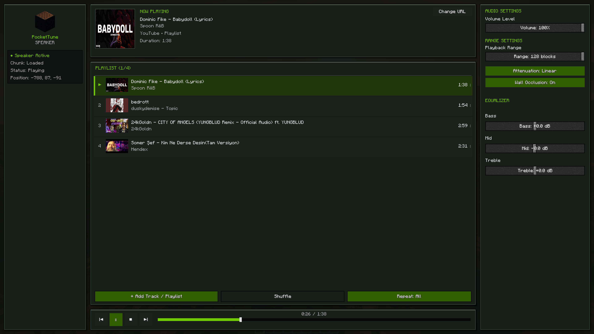
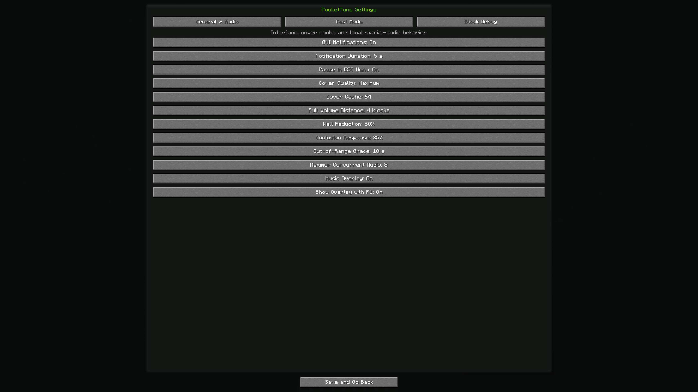

<div align="center">

# 🎵 PocketTune

**A synchronized YouTube speaker and portable music player for Minecraft.**

[](https://github.com/Muhammedtalha04/PocketTune/actions/workflows/build.yml)
[](https://github.com/Muhammedtalha04/PocketTune/releases)
[](https://www.minecraft.net/)
[](https://neoforged.net/)
[](https://adoptium.net/)
[](LICENSE)
[](https://buymeacoffee.com/mtktalha)

[Türkçe](docs/README.tr.md) · [Configuration](docs/CONFIGURATION.md) · [Development](DEVELOPMENT.md) · [Architecture](ARCHITECTURE.md) · [Contributing](CONTRIBUTING.md)

</div>

PocketTune adds a server-authoritative speaker block with synchronized playlists, spatial audio, a responsive media-player GUI and portable inventory playback. It resolves supported YouTube links with `yt-dlp` and plays audio through `mpv`; no browser, API key or paid service is required.

<p align="center">
  
</p>

## ✨ Features

- Video and playlist URLs with title, artist, duration and high-quality cover art
- Server-authoritative queue, playback clock, shuffle, repeat, seeking and multiplayer validation
- Responsive wide/compact GUI for every Minecraft GUI scale and common aspect ratio
- Clear drag-and-drop queue preview, insertion marker and track context menu
- 4–128 block range, multiple attenuation curves, multi-ray wall occlusion and live equalizer
- Persistent speaker state across chunk loads, world restarts and portable pickup/placement
- Compact top-right now-playing overlay with optional visibility while the F1 HUD is hidden
- Correct ESC pause-chain behavior: music stays paused through Options/Mods and resumes only in gameplay
- Inventory, chest, crafting and third-party screens do not interrupt playback
- Native NeoForge config screens plus opt-in spatial and block-interaction diagnostics
- Bounded external processes, queues, caches, packet validation and privacy-safe logs

## 📸 In-game gallery

<p align="center">
  
  <br>
  <sub>Compact now-playing overlay with cover art, artist, playback state and progress.</sub>
</p>

<table>
  <tr>
    <td width="50%" align="center">
      
      <br><sub>Portable playback keeps the music and metadata with the speaker.</sub>
    </td>
    <td width="50%" align="center">
      
      <br><sub>English configuration for audio, overlays, test mode and block diagnostics.</sub>
    </td>
  </tr>
</table>

## 📦 Compatibility and runtime requirements

| Environment | Required |
|---|---|
| All installations | Minecraft Java 1.21.4, NeoForge 21.4.x, PocketTune JAR |
| Single-player / listening client | Java 21, `yt-dlp`, `mpv` |
| Dedicated server | Java 21, `yt-dlp`; `mpv` is not required |
| Connected player that should hear audio | `yt-dlp` and `mpv` |

PocketTune accepts supported HTTPS YouTube video and playlist URLs. The server owns playlist and speaker state; each listening client owns its local audio process.

## 🎮 Player installation and use

1. Install NeoForge 21.4.x for Minecraft 1.21.4.
2. Install current versions of [`yt-dlp`](https://github.com/yt-dlp/yt-dlp) and [`mpv`](https://mpv.io/installation/) and make them available on `PATH`.
3. Put `pockettune-0.7.1.jar` in the Minecraft `mods` folder, then start Minecraft.
4. Place a PocketTune speaker and right-click normally to open it. Sneak + right-click picks it up without losing its state.
5. Add a supported YouTube video/playlist URL from the GUI and control the queue, sound and spatial settings there.

If the tools cannot be added to `PATH`, set their absolute executable paths in `config/pockettune-common.toml`. See [Configuration](docs/CONFIGURATION.md) and [Troubleshooting](docs/TROUBLESHOOTING.md).

## ⚡ One-command development setup

Clone the repository, enter it, then run one command. The setup detects missing Git, JDK 21, `yt-dlp` and `mpv`, installs them through the platform package manager when possible, configures the ignored development game directories and runs JUnit without opening Minecraft.

**Windows (PowerShell / WinGet)**

```powershell
powershell -ExecutionPolicy Bypass -File .\setup.ps1
```

**macOS or Linux**

```bash
./setup.sh
```

Read-only audit: `./setup.sh --check-only` or `.\setup.ps1 -CheckOnly`. Skip media tools for server-only work with `--skip-runtime-tools` / `-SkipRuntimeTools`.

Then build the production JAR:

```powershell
.\gradlew.bat clean build --no-daemon
```

```bash
./gradlew clean build --no-daemon
```

Output: `build/libs/pockettune-0.7.1.jar`. Detailed workflows live in [DEVELOPMENT.md](DEVELOPMENT.md).

## 🤖 AI-assisted development

The repository is intentionally optimized for Codex, Claude Code, Cursor, Windsurf and Cline:

- [`AGENTS.md`](AGENTS.md) is the concise, tool-neutral source of repository rules.
- [`CLAUDE.md`](CLAUDE.md), [Cursor rules](.cursor/rules/pockettune.mdc), [Windsurf rules](.windsurf/rules/pockettune.md) and [Cline rules](.clinerules/00-pockettune.md) point agents to the same source of truth.
- [`prompts/CODEX.md`](prompts/CODEX.md) and [`prompts/CLAUDE_CODE.md`](prompts/CLAUDE_CODE.md) provide optimized first-session prompts.
- [`ARCHITECTURE.md`](ARCHITECTURE.md) maps ownership and data flow; focused directory READMEs reduce indexing cost.

Paste the relevant prompt into the agent after cloning. It will audit the environment with the one-command setup before changing code.

## ⚙️ Configuration and debug tools

PocketTune separates settings by ownership:

- `pockettune-client.toml`: UI, overlay, thumbnails, client audio response and opt-in test/debug visuals.
- `pockettune-common.toml`: machine-local executable overrides and local process limits.
- `<world>/serverconfig/pockettune-server.toml`: authoritative default volume and maximum range.

Test mode can render full-volume boundaries, attenuation layers and the actual wall-occlusion rays. Block debug mode traces interaction events, packets, destroy callbacks, BlockEntity lifecycle and client/server BlockState comparison. Both are disabled by default.

## 🧭 Documentation map

| Document | Purpose |
|---|---|
| [ARCHITECTURE.md](ARCHITECTURE.md) | Modules, trust boundaries and playback lifecycle |
| [DEVELOPMENT.md](DEVELOPMENT.md) | Setup, build, tests and release checks |
| [CONTRIBUTING.md](CONTRIBUTING.md) | Contribution and pull-request workflow |
| [docs/CONFIGURATION.md](docs/CONFIGURATION.md) | Every configuration family and ownership rule |
| [docs/TROUBLESHOOTING.md](docs/TROUBLESHOOTING.md) | Tool, playback and synchronization diagnostics |
| [SECURITY.md](SECURITY.md) | Vulnerability reporting and security model |
| [PROJECT_STATUS.md](PROJECT_STATUS.md) | Current release status and remaining manual validation |

## 🤝 Open source and attribution

PocketTune is free and open-source under the [Apache License 2.0](LICENSE). You may use it in your own game, server or modpack; fork it; modify it; redistribute it; or use it as the foundation of another project. Keep the license and the attribution in [`NOTICE`](NOTICE) with redistributed source or binaries. A visible README link back to [PocketTune](https://github.com/Muhammedtalha04/PocketTune) and [Muhammedtalha04](https://github.com/Muhammedtalha04) is appreciated and makes the project lineage clear.

## ☕ Support the project

PocketTune remains fully free: support never unlocks features or changes the license. If the project is useful to you, an optional contribution is welcome at [Buy Me a Coffee](https://buymeacoffee.com/mtktalha).

## ⚠️ Service notice

PocketTune is an independent project and is not affiliated with Mojang, Microsoft, YouTube, Google, NeoForge, yt-dlp or mpv. Users and server operators are responsible for following the terms and laws applicable to media they access.
